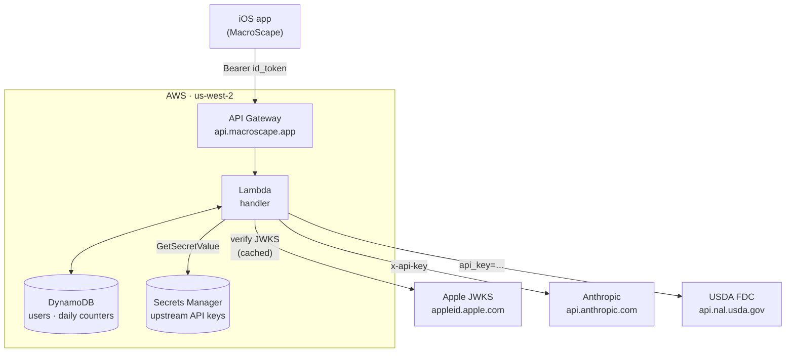

# macroscape-proxy

[](https://github.com/steveboyer/macroscape-proxy/actions/workflows/ci.yml)

AWS Lambda proxy for the MacroScape iOS app. Served at `https://api.macroscape.app`. Authenticates
Sign in with Apple callers, applies a per-user daily rate limit, and forwards requests to upstream
APIs (Anthropic, USDA FoodData Central) with a strict header allowlist and centralized API key
handling.

The HTTP contract for callers lives in [`CONTRACT.md`](./CONTRACT.md); the backlog and decision log
lives in [`issues.md`](./issues.md). Operator setup notes (third-party registrations, etc.) live
under [`docs/`](./docs/).

## Architecture



Two CDK stacks in `bin/macroscape-proxy.ts`:

- **`MacroScapeProxyStack`** - the runtime proxy. Wires API Gateway HTTP API (custom domain
  `api.macroscape.app` with ACM cert + Route 53 alias records), a Node.js 22 / ARM64 Lambda bundled
  by esbuild via `NodejsFunction`, a DynamoDB single-table store (`USER#<sub>` profiles,
  `USAGE#<sub>` daily counters with 90-day TTL), and three Secrets Manager entries for upstream API
  keys. CloudWatch log group is explicit with 2-week retention.
- **`MacroScapeProxyGithubOidcStack`** - one-time CI bootstrap. Provisions a GitHub OIDC provider
  and a deploy role (`MacroScapeProxyGithubDeployRole`) that GitHub Actions assumes on push to
  `main`. The role doesn't deploy directly; it's allowed to assume the CDK bootstrap roles, which
  actually run `cdk deploy`.

The Lambda source lives in `src/`; CDK infrastructure code lives in `bin/` + `lib/`. The two are
kept independent. Lambda is compiled with `tsc` and bundled by esbuild for deployment; CDK runs via
`ts-node`. Routes:

| Route                         | Notes                                              |
| ----------------------------- | -------------------------------------------------- |
| `GET /health`                 | Auth-gated; returns the verified Apple `sub`.      |
| `POST /v1/anthropic/messages` | Forwards to `api.anthropic.com/v1/messages`.       |
| `GET /v1/usda/foods/search`   | Forwards to USDA FoodData Central `/foods/search`. |

See `CONTRACT.md` for request/response shapes, error envelopes, and rate-limit semantics.

## Local development

Requires Node.js 22 (see `.nvmrc`).

```sh
nvm use
npm install
npm run lint
npm run format:check
npm run build         # tsc - compiles src/ only (Lambda code)
npm test              # vitest run
npm run cdk -- synth  # validate CDK app compiles + synthesizes
```

There is no `sam local` workflow yet. Exercise the deployed dev API directly, or run vitest against
the unit-tested modules (currently the Apple ID token verifier; integration tests are tracked as
MSP023).

## AWS prerequisites

For a fresh AWS account:

1. **Bootstrap CDK** in your target account/region:
   ```sh
   npx cdk bootstrap aws://<account-id>/<region>
   ```
2. **Deploy the OIDC stack once** so GitHub Actions can assume a deploy role:
   ```sh
   npm run cdk -- deploy MacroScapeProxyGithubOidcStack
   ```
   The `githubOwner` / `githubRepo` / `allowedBranches` values are configured in
   `bin/macroscape-proxy.ts`. Add the deployed role ARN to the `AWS_DEPLOY_ROLE_ARN` secret on the
   GitHub repo so `.github/workflows/deploy.yml` can assume it.
3. **Register `macroscape.app`** at your registrar (currently Namecheap). The runtime stack creates
   the Route 53 hosted zone on first deploy; you'll then need to copy the four nameservers from the
   `HostedZoneNameServers` stack output into the registrar's NS records. ACM cert validation hangs
   until NS delegation propagates. This typically takes minutes.

## Deploy

CI/CD: every push to `main` runs `.github/workflows/deploy.yml`, which assumes the OIDC deploy role
and runs `cdk deploy MacroScapeProxyStack --require-approval never`. Deployments are serialized via
`concurrency: { group: deploy, cancel-in-progress: false }`.

Manual deploy from a workstation with AWS credentials:

```sh
npm run cdk -- diff MacroScapeProxyStack
npm run cdk -- deploy MacroScapeProxyStack
```

After the first deploy, populate the three Secrets Manager entries (all created empty by the stack):

| Secret name                                 | Contents                                                                                                                                                                                                      |
| ------------------------------------------- | ------------------------------------------------------------------------------------------------------------------------------------------------------------------------------------------------------------- |
| `macroscape-proxy/upstream-api-key`         | Anthropic API key (sk-ant-…).                                                                                                                                                                                 |
| `macroscape-proxy/usda-api-key`             | USDA FoodData Central API key (register at api.data.gov).                                                                                                                                                     |
| `macroscape-proxy/apple-signin-private-key` | Apple Sign-In `.p8` private key (currently unused; auth path is JWKS-only. This is populated when the OAuth code-exchange / token-revocation path lands). See [`docs/apple-setup.md`](./docs/apple-setup.md). |

Each is read by the Lambda via `secretsmanager:GetSecretValue` and cached for the lifetime of the
warm container. See "Rotating an upstream API key" below for how that interacts with rotation.

## Rotating an upstream API key

The Anthropic and USDA keys can be rotated with no code change. The Lambda fetches each secret value
once per cold start and caches it for the lifetime of the warm container, so a rotation propagates
as warm containers recycle (typically minutes, up to ~15).

1. Mint a new key with the upstream (Anthropic Console, or `api.data.gov` for USDA).
2. Write it to the same secret name:
   ```sh
   aws secretsmanager put-secret-value \
     --secret-id macroscape-proxy/upstream-api-key \
     --secret-string '<new-key>'
   ```
   (Or use the Secrets Manager console.) This creates a new `AWSCURRENT` version; the previous
   version becomes `AWSPREVIOUS` and remains readable.
3. To force immediate rollout instead of waiting for warm-container recycling, update the Lambda's
   environment (any no-op change triggers a new execution environment):
   ```sh
   aws lambda update-function-configuration \
     --function-name <MacroScapeProxyStack-ProxyHandler…> \
     --environment "Variables={…,KEY_ROTATED_AT=$(date -u +%s)}"
   ```
   Or just redeploy: `npm run cdk -- deploy MacroScapeProxyStack`.
4. Once you've confirmed traffic is flowing on the new key (CloudWatch logs show successful upstream
   calls), revoke the old key at the upstream.

For the Apple Sign-In `.p8`, follow the same write-secret + force-redeploy steps once that path is
in use. Note that the JWKS-based verification of incoming id_tokens (`src/auth/appleVerifier.ts`)
does not use the `.p8`; only the future server-side OAuth flow does.

## Stack

- AWS CDK (TypeScript), CDK v2
- Lambda (Node.js 22, ARM64) behind API Gateway HTTP API
- DynamoDB single-table design
- Secrets Manager for upstream API keys
- `jose` for Apple ID token verification (JWKS-based, module-cached)

## License

[MIT](./LICENSE)
